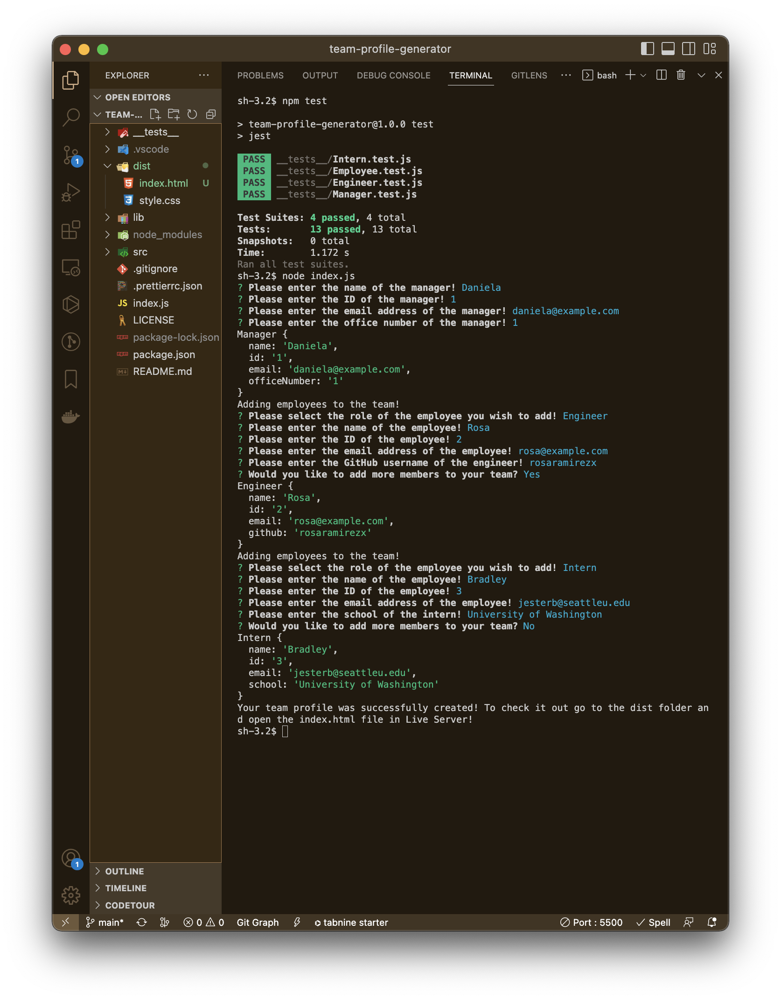
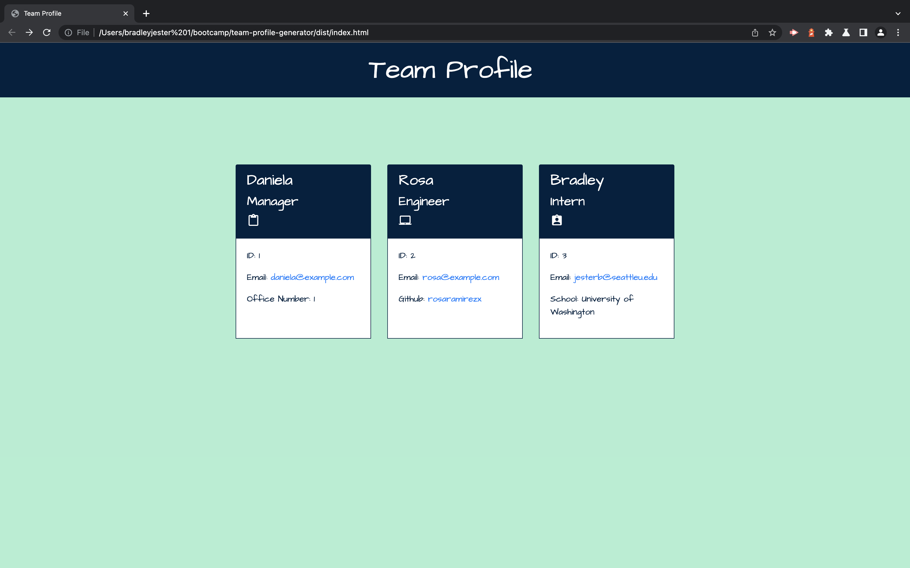

# Team Profile Generator

 

## License

 

[This application is under the MIT license](https://opensource.org/licenses/MIT)

 

## Description

 

A Node.js command-line application that takes in information about employees on a software engineering team and generates an HTML webpage that displays summaries for each person. **Team Profile Generator** uses `Jest` for running unit tests and `Inquirer` for collecting user input. It also features validation to ensure that user input provided is in the proper expected format. **Team Profile Generator** used both `Object Oriented Programming` and `Test Driven Development` in its development.

 

## Installation

 

Clone the repository to your local machine, open your terminal, and navigate to the root folder in the **Team Profile Generator** repository. To install the necessary dependencies, run `npm i` in your command-line terminal.

 

## Usage

 

To begin, the application is invoked by using the following command: `node index.js`. From there, you be asked to add a **manager**. Please enter their name, ID, email address, and office number. You can also add an **engineer** (or multiple engineers) and an **intern** (or multiple interns). Please enter an engineer's name, ID, email address, and GitHub username and an intern's name, ID, email address, and the school that they're currently attending.

 

 

When you're all finished you can find the generated index.html file in the `dist` folder where you can view it in the browser.

 

 

## Badges

 

 

 

 

 

 

 

 

 

 

 

 

 

## Questions

 

If you have any additional questions, you can reach me at:

 

### GitHub

 

 

[jesterb0206](https://www.github.com/jesterb0206)

 

### Email

 

 

jesterb@seattleu.edu

 

## Tests

 

**Team Profile Generator** uses the **Jest** package for a suite of unit tests. To run the unit tests enter `npm test` in your command-line terminal in the root folder of **Team Profile Generator**.

 
